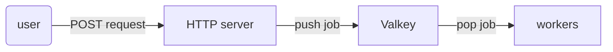

# redis_queue

Demo containerized HTTP server and workers with Redis/Valkey job queue. Written in Rust with Axum and Tokio.

## More details?

This is a small Rust web application. It can run as either an HTTP server or a worker, depending on whether the `APP_TYPE` environment variable is set to "server" or "worker." 

As a server, it accepts work through HTTP POST requests, adding jobs to a Valkey (Redis) queue. This queue is occasionally polled by separately run workers who log their results to stdout.




The work done by this system is simple math: addition, subtraction, and multiplication. The endpoint path POSTed to (e.g., `http://127.0.0.1:3000/add`) determines the operation. The input values are taken from the request's JSON body.

This is a simple, quick, and dirty toy example for learning. Do not use this in production.


## How is this run?

Spawn local HTTP server, workers, and Valkey containers with `docker compose` with

```bash
docker compose up
```

Keep this terminal session open to see workers containers respond requests. The containers will take a moment to spin up. The container image with the rust application is roughly 35 MB once it is compiled and built.

Once the containers are up and running, POST to the server from a separate terminal with `curl`, for example

```bash
curl -i -H "Content-Type: application/json" \
  -X POST -d '{"one": 1, "two": 2}' \
  http://127.0.0.1:3000/add

curl -i -H "Content-Type: application/json" \
  -X POST -d '{"one": 5, "two": 3}' \
  http://127.0.0.1:3000/subtract

curl -i -H "Content-Type: application/json" \
  -X POST -d '{"one": 3, "two": 3}' \
  http://127.0.0.1:3000/multiply
```

See the worker containers respond to activity in the original terminal session. They should respond within a minute.


## Acknowledgments

This code is built from an example in chapter 18 of Maxwell Flitton (2023) "Rust Web Programming".
